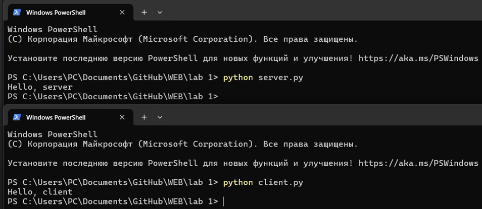

# Задание 1

Реализовать клиентскую и серверную часть приложения. Клиент отсылает серверу сообщение «Hello, server». Сообщение должно отразиться на стороне сервера. Сервер в ответ отсылает клиенту сообщение «Hello, client». Сообщение должно отобразиться у клиента. Обязательно использовать библиотеку socket Реализовать с помощью протокола UDP

---

## Решение

### `server.py`

```python

import socket

HOST, PORT = "127.0.0.1", 9999
sock = socket.socket(socket.AF_INET, socket.SOCK_DGRAM)
sock.bind((HOST, PORT))

data, addr = sock.recvfrom(1024)
print("from client:", data.decode())
sock.sendto(b"Hello, client", addr)

sock.close()
```
Сервер слушает `127.0.0.1:9999`, получает одно сообщение, печатает его и отвечает «Hello, client», затем завершает работу.

### `client.py`
```python
import socket

HOST, PORT = "127.0.0.1", 9999
sock = socket.socket(socket.AF_INET, socket.SOCK_DGRAM)
sock.sendto(b"Hello, server", (HOST, PORT))

data, _ = sock.recvfrom(1024)
print("from server:", data.decode())

sock.close()
```
Клиент посылает «Hello, server» на 127.0.0.1:9999, ждёт ответ, печатает его и закрывается.

