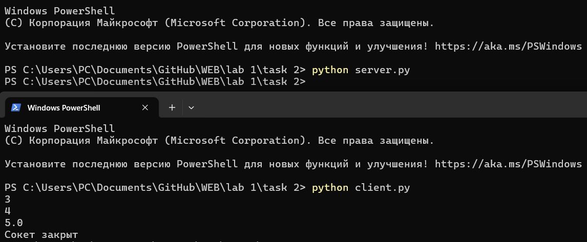

# Задание 2

Реализовать клиентскую и серверную часть приложения. Клиент запрашивает выполнение математической операции, параметры которой вводятся с клавиатуры. Сервер обрабатывает данные и возвращает результат клиенту.

Математическая операция: Теорема Пифагора.

---

## Решение

### `server.py`

```python
import socket

# Создаём TCP-сокет и привязываем к адресу/порту
sock = socket.socket(socket.AF_INET, socket.SOCK_STREAM)
sock.bind(('localhost', 8080))

# Начинаем слушать и принимаем одно входящее подключение 
sock.listen()
conn, addr = sock.accept()

# Получаем данные, разбиваем строку на два числа
nums = conn.recv(1024).decode()
arr = nums.split()
a = float(arr[0])
b = float(arr[1])

# Вычисляем результат (гипотенуза) и готовим строковый ответ 
c = (a ** 2 + b ** 2) ** 0.5
answer = str(c)

# Отправляем ответ клиенту и закрываем серверный сокет
conn.send(answer.encode())
sock.close()

```
### `client.py`

```python
import socket

# Создаём TCP-сокет и подключаемся к серверу
sock = socket.socket(socket.AF_INET, socket.SOCK_STREAM)
sock.connect(('localhost', 8080))

# Читаем два числа у пользователя и формируем строку для отправки
a = float(input())
b = float(input())
data = f"{a} {b}"

# Отправляем данные, ждём ответ, печатаем результат
sock.send(data.encode())
print(sock.recv(1024).decode())

# Закрываем клиентский сокет
sock.close()
print("Сокет закрыт")

```
