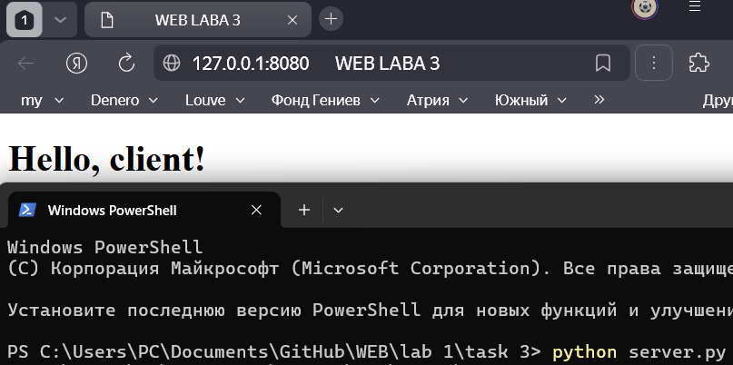

# Задание 3

Реализовать серверную часть приложения. Клиент подключается к серверу, и в ответ получает HTTP-сообщение, содержащее HTML-страницу, которая сервер подгружает из файла index.html.

---

## Решение

### `server.py`

```python
import socket

# создаём TCP-сокет
sock = socket.socket(socket.AF_INET, socket.SOCK_STREAM)

# привязываем к адресу и порту и начинаем слушать
sock.bind(('127.0.0.1', 8080))
sock.listen()

# принимаем одно клиентское подключение
conn, addr = sock.accept()

# читаем HTTP-запрос от клиента (нам достаточно заголовков)
request = conn.recv(2048).decode()

# открываем html-файл и читаем как байты
with open("index.html", "rb") as f:
    html_bytes = f.read()
    length = len(html_bytes)

    # формируем статусную строку и заголовки ответа
    headers = (
        "HTTP/1.1 200 OK\r\n"
        "Content-Type: text/html; charset=utf-8\r\n"
        f"Content-Length: {length}\r\n"
        "Connection: close\r\n"
        "\r\n"
    )

    # отправляем заголовки и тело страницы
    conn.sendall(headers.encode("utf-8"))
    conn.sendall(html_bytes)

    # закрываем соединение с клиентом
    conn.close()

# закрываем серверный сокет
sock.close()
```
### `index.html`

```html
<!DOCTYPE html>
<html lang="en">
<head>
  <meta charset="UTF-8">
  <title>WEB LABA 3</title>
</head>
<body>
  <h1>Hello, client!</h1>
</body>
</html>
```


В рамках задания был реализован  HTTP-сервер на сокетах.  
Он принимает подключение по TCP, обрабатывает HTTP-запрос и возвращает статическую страницу `index.html` с корректными заголовками.  

