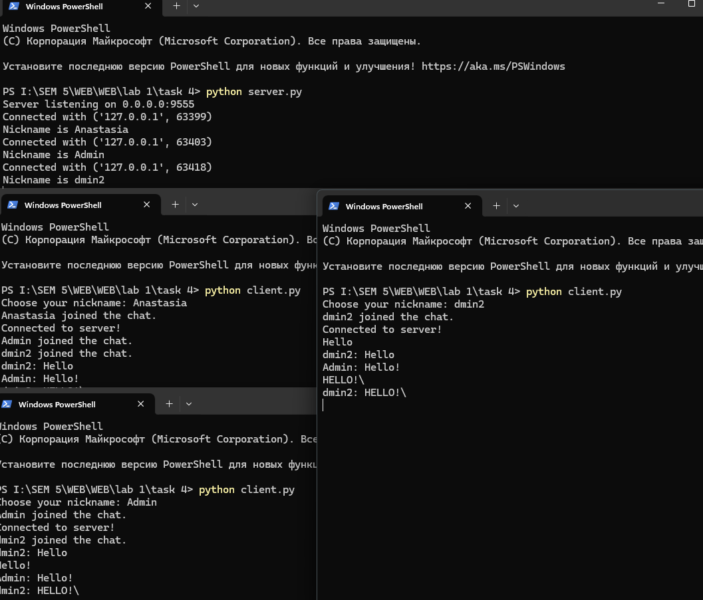

# Задание 4

Реализовать двухпользовательский или многопользовательский чат. Реализация многопользовательского чата позволяет получить максимальное количество баллов.

Реализовать с помощью протокола TCP – 100% баллов, с помощью UDP – 80%.
Обязательно использовать библиотеку threading.

Для реализации с помощью UDP, threading использовать для получения сообщений у клиента.
Для применения с TCP необходимо запускать клиентские подключения И прием и отправку сообщений всем юзерам на сервере в потоках.
Не забудьте сохранять юзеров, чтобы потом отправлять им сообщения.

Реализован многопользовательский чат.

---

## Решение
### `server.py`
```python
import socket
import threading

# базовая конфигурация и инициализация прослушивающего TCP-сокета
HOST = '0.0.0.0'
PORT = 9555
server = socket.socket(socket.AF_INET, socket.SOCK_STREAM)
server.setsockopt(socket.SOL_SOCKET, socket.SO_REUSEADDR, 1)
server.bind((HOST, PORT))
server.listen()
print(f'Server listening on {HOST}:{PORT}')

# общее хранилище активных соединений и никнеймов; блокировка для безопасного доступа из потоков
clients = []
nicknames = []
clients_lock = threading.Lock()

# утилита для рассылки сообщения всем подключённым клиентам
def broadcast(message: bytes):
    with clients_lock:
        for client in clients:
            try:
                client.sendall(message)
            except:
                # если отправка не удалась, просто пропускаем этот сокет
                pass

# обработчик одного клиента: читаем сообщения и транслируем их всем
def handle(client: socket.socket):
    while True:
        try:
            # приём очередного сообщения от клиента
            data = client.recv(1024)
            if not data:
                # пустые данные означают закрытие соединения клиентом
                raise ConnectionResetError

            # определяем ник клиента для префикса сообщения
            with clients_lock:
                idx = clients.index(client)
                nickname = nicknames[idx]

            # формируем строку "nickname: текст" и рассылаем всем
            message = f'{nickname}: {data.decode("utf-8")}\n'
            broadcast(message.encode('utf-8'))

        except:
            # удаляем клиента из списков и уведомляем остальных о выходе
            with clients_lock:
                if client in clients:
                    idx = clients.index(client)
                    clients.remove(client)
                    nickname = nicknames.pop(idx)
                else:
                    nickname = 'unknown'
            try:
                client.close()
            finally:
                broadcast(f'{nickname} left the chat.\n'.encode('utf-8'))
                print(f'{nickname} left the chat.')
            break

# главный цикл принятия подключений и первичной регистрации клиента (handshake)
def receive():
    while True:
        # ожидание нового входящего подключения
        client, address = server.accept()
        print(f'Connected with {address}')

        try:
            # простое рукопожатие: запрашиваем ник и получаем его
            client.sendall(b'NICK')
            nickname = client.recv(1024).decode('utf-8').strip()
        except:
            client.close()
            continue

        # сохраняем клиента и его ник для последующих рассылок
        with clients_lock:
            clients.append(client)
            nicknames.append(nickname)

        # уведомляем всех о присоединении и запускаем поток-обработчик
        print(f'Nickname is {nickname}')
        broadcast(f'{nickname} joined the chat.\n'.encode('utf-8'))
        client.sendall(b'Connected to server!\n')

        # отдельный поток для приёма сообщений от этого клиента
        threading.Thread(target=handle, args=(client,), daemon=True).start()

if __name__ == '__main__':
    try:
        receive()
    except KeyboardInterrupt:
        # аккуратное завершение по Ctrl+C
        print('\nShutting down...')
    finally:
        # закрываем все активные сокеты и слушатель
        with clients_lock:
            for c in clients:
                c.close()
        server.close()
```

### `client.py`

```python
import socket
import threading

# ввод ника перед подключением; пустой ник заменяем на Anonymous
nickname = input('Choose your nickname: ').strip() or 'Anonymous'

# создание TCP-сокета клиента и подключение к серверу
client = socket.socket(socket.AF_INET, socket.SOCK_STREAM)
client.connect(('127.0.0.1', 9555))

# фоновый поток: непрерывно читаем сообщения от сервера и печатаем их
def receive():
    while True:
        try:
            message = client.recv(1024).decode('utf-8')
            if not message:
                print('[Disconnected from server]')
                break

            # обработка простого рукопожатия ника
            if message == 'NICK':
                client.send(nickname.encode('utf-8'))
            else:
                # печатаем входящее сообщение; добавляем перенос строки при необходимости
                print(message, end='' if message.endswith('\n') else '\n')
        except:
            # любое исключение трактуем как разрыв связи и закрываем сокет
            print('An error occurred. Closing connection.')
            client.close()
            break

# фоновый поток: читаем пользовательский ввод и отправляем на сервер
def write():
    while True:
        try:
            text = input()
        except EOFError:
            # разрешаем завершение клиента по EOF (Ctrl+Z/Ctrl+D в разных ОС)
            break
        try:
            client.send(text.encode('utf-8'))
        except:
            # если отправка не удалась, завершаем поток отправки
            break

# запускаем два независимых потока: приём и отправка, чтобы они не блокировали друг друга
receive_thread = threading.Thread(target=receive)
receive_thread.start()
write_thread = threading.Thread(target=write)
write_thread.start()
```



В работе реализован многопользовательский чат на TCP с использованием threading. Сервер принимает новые подключения, хранит список клиентов и никнеймов и рассылает сообщения всем участникам в потокобезопасном режиме. Для каждого клиента запускается отдельный поток обработки, а у клиента разнесены получение и отправка сообщений по двум потокам, что исключает блокировки. Решение соответствует требованиям задания и корректно обрабатывает подключение/отключение пользователей. 