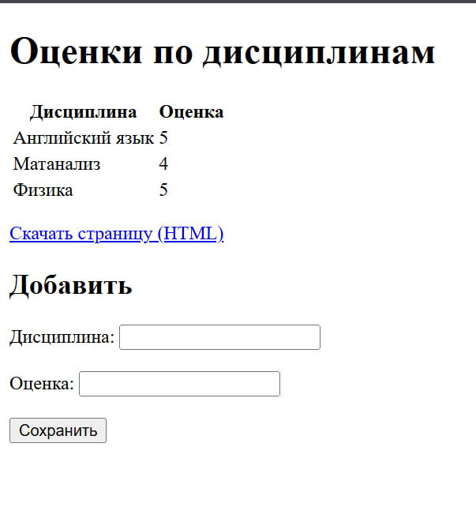

# Задание 5
Написать простой веб-сервер для обработки GET и POST HTTP-запросов с помощью библиотеки socket в Python.

Сервер должен:
Принять и записать информацию о дисциплине и оценке по дисциплине.
Отдать информацию обо всех оценках по дисциплинам в виде HTML-страницы.
---

## Решение
### `server.py`
```python
import socket
import sys

# разбираем application/x-www-form-urlencoded: '+' -> пробел, %xx -> байт (потом UTF-8)
def url_decode(s: str) -> str:
    s = s.replace('+', ' ')
    buf = bytearray()
    i = 0
    while i < len(s):
        ch = s[i]
        if ch == '%' and i + 2 < len(s):
            try:
                buf.append(int(s[i+1:i+3], 16))
                i += 3
                continue
            except ValueError:
                pass
        buf.extend(ch.encode('utf-8'))
        i += 1
    return buf.decode('utf-8', errors='strict')

# превращаем строку формата k=v&k2=v2 в словарь с раскодированием ключей и значений
def parse_params(qs: str) -> dict:
    params = {}
    if not qs:
        return params
    for pair in qs.split('&'):
        if not pair:
            continue
        k, v = (pair.split('=', 1) + [''])[:2]
        params[url_decode(k)] = url_decode(v)
    return params


class MyHTTPServer:
    # сохраняем настройки и поднимаем данные из файла
    def __init__(self, host, port, name="MyHTTPServer"):
        self.host = host
        self.port = port
        self.name = name
        self.grades = []
        self.load_from_file()

    # читаем оценки из grades.txt (UTF-8, формат: предмет<TAB>оценка)
    def load_from_file(self):
        try:
            with open("grades.txt", "r", encoding="utf-8") as f:
                for line in f:
                    line = line.rstrip("\n")
                    if not line:
                        continue
                    parts = line.split("\t")
                    if len(parts) == 2:
                        self.grades.append((parts[0], parts[1]))
        except FileNotFoundError:
            pass

    # дописываем новую запись в grades.txt
    def save_to_file(self, subject, grade):
        with open("grades.txt", "a", encoding="utf-8") as f:
            f.write(f"{subject}\t{grade}\n")

    # основной цикл сервера: bind/listen/accept и передача в обработчик
    def serve_forever(self):
        with socket.socket(socket.AF_INET, socket.SOCK_STREAM) as srv:
            srv.setsockopt(socket.SOL_SOCKET, socket.SO_REUSEADDR, 1)
            srv.bind((self.host, self.port))
            srv.listen(5)
            print(f"Serving on http://{self.host}:{self.port}")
            while True:
                conn, addr = srv.accept()
                try:
                    self.serve_client(conn)
                except Exception:
                    try:
                        self.send_response(
                            conn, 500, "Internal Server Error",
                            "<h1>500 Internal Server Error</h1>".encode("utf-8"),
                            {"Content-Type": "text/html; charset=utf-8"}
                        )
                    finally:
                        conn.close()
                else:
                    conn.close()

    # читаем первую строку, заголовки и тело (если есть Content-Length)
    def serve_client(self, conn):
        rfile = conn.makefile("rb")
        method, path, version = self.parse_request(rfile)
        headers = self.parse_headers(rfile)

        body = b""
        if "content-length" in headers:
            try:
                length = int(headers["content-length"])
                if length > 0:
                    body = rfile.read(length)
            except Exception:
                body = b""

        self.handle_request(conn, method, path, headers, body)

    # парсим стартовую строку HTTP: METHOD SP PATH SP VERSION
    def parse_request(self, rfile):
        line = rfile.readline().decode("utf-8", errors="replace").strip()
        if not line:
            return "GET", "/", "HTTP/1.1"
        parts = line.split()
        if len(parts) != 3:
            return "GET", "/", "HTTP/1.1"
        return parts[0], parts[1], parts[2]

    # читаем заголовки до пустой строки, кладём в словарь в нижнем регистре
    def parse_headers(self, rfile):
        headers = {}
        while True:
            line = rfile.readline()
            if not line:
                break
            line = line.decode("utf-8", errors="replace")
            if line in ("\r\n", "\n", ""):
                break
            if ":" in line:
                name, value = line.split(":", 1)
                headers[name.strip().lower()] = value.strip()
        return headers

    # собираем HTML: строки таблицы из self.grades + вставка в шаблон index.html
    def build_html(self) -> bytes:
        if self.grades:
            rows = "\n".join(f"<tr><td>{subj}</td><td>{gr}</td></tr>"
                             for subj, gr in self.grades)

        with open("index.html", "r", encoding="utf-8") as f:
            html = f.read()

        html = html.replace("{{ROWS}}", rows)
        return html.encode("utf-8")

    # простой роутинг: GET /, GET /download, POST /add, иначе 404
    def handle_request(self, conn, method, path, headers, body):
        if "?" in path:
            url_path, _ = path.split("?", 1)
        else:
            url_path = path

        if method == "GET" and url_path == "/":
            content = self.build_html()
            self.send_response(conn, 200, "OK", content,
                               {"Content-Type": "text/html; charset=utf-8"})
            return

        if method == "GET" and url_path == "/download":
            content = self.build_html()
            self.send_response(
                conn, 200, "OK", content,
                {
                    "Content-Type": "text/html; charset=utf-8",
                    "Content-Disposition": 'attachment; filename="grades.html"',
                }
            )
            return

        if method == "POST" and url_path == "/add":
            # тело формы приходит ASCII-строкой k=v&k2=v2; сами значения в %xx (декодим выше)
            data = body.decode("ascii", errors="strict")
            params = parse_params(data)
            subject = params.get("subject", "").strip()
            grade = params.get("grade", "").strip()

            if subject and grade:
                self.grades.append((subject, grade))
                self.save_to_file(subject, grade)
                content = self.build_html()
                self.send_response(conn, 200, "OK", content,
                                   {"Content-Type": "text/html; charset=utf-8"})
            else:
                msg = "<h1>400 Bad Request</h1><p>Нужны поля subject и grade.</p>".encode("utf-8")
                self.send_response(conn, 400, "Bad Request", msg,
                                   {"Content-Type": "text/html; charset=utf-8"})
            return

        self.send_response(conn, 404, "Not Found",
                           "<h1>404 Not Found</h1>".encode("utf-8"),
                           {"Content-Type": "text/html; charset=utf-8"})

    # формируем статусную строку и заголовки, затем отправляем тело ответа
    def send_response(self, conn, status_code, reason, body_bytes, extra_headers=None):
        if extra_headers is None:
            extra_headers = {}
        conn.sendall(f"HTTP/1.1 {status_code} {reason}\r\n".encode("utf-8"))
        headers = {
            "Server": self.name,
            "Content-Length": str(len(body_bytes)),
            "Connection": "close",
        }
        headers.update(extra_headers)
        for k, v in headers.items():
            conn.sendall(f"{k}: {v}\r\n".encode("utf-8"))
        conn.sendall(b"\r\n")
        conn.sendall(body_bytes)


if __name__ == "__main__":
    # параметры по умолчанию + возможность передать host/port/name из командной строки
    host = "127.0.0.1"
    port = 8080
    name = "MyHTTPServer"
    if len(sys.argv) >= 2: host = sys.argv[1]
    if len(sys.argv) >= 3: port = int(sys.argv[2])
    if len(sys.argv) >= 4: name = sys.argv[3]

    serv = MyHTTPServer(host, port, name)
    try:
        serv.serve_forever()
    except KeyboardInterrupt:
        print("\nStopped")
```
### `index.html`
```html
<!doctype html>
<html lang="ru">
<head>
  <meta charset="utf-8">
  <title>Оценки</title>
</head>
<body>
  <h1>Оценки по дисциплинам</h1>

  <!-- таблица с данными; {{ROWS}} заменяется сервером на <tr>...</tr> -->
  <table>
    <tr><th>Дисциплина</th><th>Оценка</th></tr>
    {{ROWS}}
  </table>

  <!-- ссылка для скачивания текущего HTML (отдаётся с Content-Disposition: attachment) -->
  <p><a href="/download">Скачать страницу (HTML)</a></p>

  <!-- форма добавления записи; отправляет POST /add в UTF-8 -->
  <h2>Добавить</h2>
  <form method="POST" action="/add" accept-charset="UTF-8">
    <label>
      Дисциплина:
      <input name="subject" required>
    </label>
    <br><br>
    <label>
      Оценка:
      <input name="grade" required>
    </label>
    <br><br>
    <button type="submit">Сохранить</button>
  </form>
</body>
</html>
```



Реализован минимальный HTTP-сервер на сокетах, который принимает данные через POST, сохраняет их и по GET отдаёт HTML-страницу со всеми оценками. Записи хранятся в файле `grades.txt`, шаблон `index.html` наполняется на лету, формы корректно разбираются (URL-кодирование, UTF-8). Решение полностью соответствует требованиям задания: есть обработка методов, заголовков и тела запроса, а также генерация корректного ответа.
